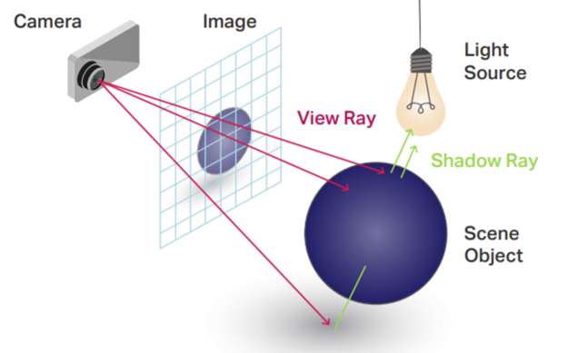

# OpenGL Shaders

## Shaders?
Shaders are simply code which is compiled and run on the computer's GPU. A shader program is made up of a Vertex Shader and a Fragment Shader.

**Vertex Shader**
- For each vertex of a geometry, dictates where that vertex exists in space.

**Fragment Shader**
- For each pixel contained within a triangle formed by the vertices, what color is that pixel?
- Part of the rasterization step which fills in the pixels of each frame.

## Types of rendering

**Rasterization**

**Ray Tracing**

**Ray Marching**

  

## Why ray marching?
Ray marching is simple to implement in a procedural manner and is an efficient way to render interesting and complex geometry. When ray marching, we describe a scene's geometry using distance functions which result in imagery that is essentially a pure expression of mathematics.

## Raymarching Learning Resources and sources for this document
- https://www.youtube.com/watch?v=Cp5WWtMoeKg
  - Super accessible intro to raymarching
- https://www.youtube.com/watch?v=C8Cuwq1eqDw
  - Simple intro to shaders in threejs
- https://www.youtube.com/c/TheArtofCodeIsCool/videos
  - Advanced and beginner hands-on shader tutorials
  - an Art of Code Raymarching tutorial - https://www.youtube.com/watch?v=Ff0jJyyiVyw&t=39s
- https://www.iquilezles.org/www/articles/distfunctions/distfunctions.htm
  - Signed Distance Functions for various shapes and a lot of useful data
  - Excellent resource with quality computer graphics information
- https://github.com/electricsquare/raymarching-workshop#comparison-to-ray-tracing
  - A great write up/workshop I found on raymarching
- https://shadertoy.com
  - An endless sea of interesting graphics demos

## Core Ideas

### Signed Distance Functions

### The Raymarching Procedure

## One math thing... Normals
A normal vector is simply a vector which is perpendicular to a surface at a given point in space. Thanks, Wolfram.com!

## Simple lighting diagram

